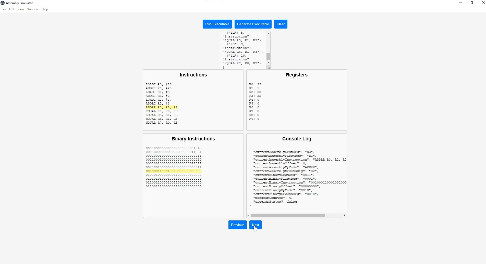

#### RISCY - Assembler simulator 

### Introduction
 RISCY is an assembly simulator. It attempts to mimic a load-store ISA (instruction set architecture). 

### Instruction Set
 
 The instruction set is composed of 32 bits, broken into
* OpCode - First Octet of 4 bits
* Destination Register - Second Octet of 4 bits
* First Register - Third Octet of 4 bits
* Second Register - Fourth Octet of 4 bits
* UNUSED - Fifth Octet of 4 bits
* Offset - Sixth Octet of 8 bits

#### Opcode
  This is essentially the assembly command. This is represented as a map - 
    
            {"LOADI", "0001"}, // LOADI R0, #10
            {"ADDRR", "0010"}, // ADDRR R1, R2, R3
            {"ADDRI", "0011"}, // ADDRI R1, #10
            {"BRNCH", "0100"}, // BRNCH <INSTRUCTION>
            {"EQUAL", "0101"}, // EQUAL R4, R5, R6
            {"NQUAL", "0110"}, // NQUAL R4, R5, R6
            {"CLOSE", "1111"}, // CLOSE

#### Destination Register
  This is location of the Destination Register. This is represented in a binary format for the location and in code is
represented by Registers interface.

#### First Register
This is location of the First Register. This is represented in a binary format for the location and in code is
represented by Registers interface.

#### Second Register
This is location of the Second Register. This is represented in a binary format for the location and in code is
represented by Registers interface.

#### Offset
This is the memory value of what we are trying to load.

### Commands

#### LOADI
This instruction is used to load a register with a value

    LOADI R0, #10
    # This will load value 10 into register R0

#### ADDRI
This instruction is used to increment existing register with a value

    ADDRI R0, #25
    # This will increment value in R0 register by 25

#### ADDRR
This instruction is used to add values from two registers and save it in a 3rd register

    ADDRR R1, R2, R3
    # This will sum the values of R2 and R3, and load it into R1

#### EQUAL
This instruction is used to compare values between two registers, if equal save 1 in a 3rd register, else 0

    EQUAL R4, R5, R6
    # This will check the values of R5 and R6, if equal will load 1 to R4 else will load 0 to R4

#### NQUAL
This instruction is used to compare values between two registers, if not equal save 1 in a 3rd register, else 0

    NQUAL R7, R5, R6
    # This will check the values of R5 and R6, if not equal will load 1 to R7, else will load 0 to R7

### Building instructions
 Requires only g++ to build. Command:
    
    cd <PROJECT_DIRECTORY>
    g++ --std=c++17 main.cpp \
        .\architecture\Architecture.cpp \ 
        .\architecture\Architecture.h \
        .\architecture\Executor.cpp \
        .\architecture\Executor.h \
        .\architecture\Parser.cpp 
        .\architecture\Parser.h 
        .\architecture\Registers.cpp 
        .\architecture\Registers.h 
        .\architecture\Stack.cpp 
        .\architecture\Stack.h 
        -o runRiscy

### Codebase

This section will document the underlying C++ classes.

#### ArchitectureWrapper

Description: Represents the architecture of a system, encapsulating registers and a stack.

##### Attributes:
- `ArchName` (`std::string`): The name of the architecture.
- `ArchRegisters` (`std::vector<RegisterWrapper>`): A vector that stores the architecture's registers.
- `ArchStack` (`StackWrapper`): A stack that holds the architecture's data.

##### Methods:
- Constructors:
    - Default Constructor: Initializes an empty architecture.
    - Parameterized Constructor: Accepts a string representing the architecture name.

- Other Methods:
    - `createStack()`: Initializes the stack for the architecture.
    - `createRegisters()`: Initializes the architecture's registers (inferred from `Architecture.cpp` but not fully visible).

#### Executor

Description: Represents an executor that manipulates the architecture.

##### Attributes:
- `simpleRISC` (`ArchitectureWrapper`): The architecture this executor works on.

##### Methods:
- Constructors:
    - Architecture Name-based Constructor: Accepts a string representing the architecture name and initializes an `ArchitectureWrapper`.

- Other Methods:
    - `getExecutorArchitectureName()`: Returns the name of the architecture.
    - `getExecutorRegisters()`: Returns a vector of registers.
    - `setExecutorRegister(std::string registerName, int value)`: Sets the value of a specific register.

#### RegisterWrapper

Description: Represents a single register.

##### Attributes:
- `registerName` (`std::string`): Name of the register.
- `registerValue` (`int`): Value stored in the register.

##### Methods:
- Constructors:
    - Default Constructor: Initializes an empty register.
    - Name-based Constructor: Accepts a string representing the register's name.
    - Name and Value-based Constructor: Accepts a string for the register's name and an integer for the value.

- Other Methods:
    - `getRegisterName()`: Returns the name of the register.
    - `getRegisterValue()`: Returns the value stored in the register.

#### StackWrapper

Description: Represents a stack, handling the storage of data.

##### Attributes
- `stackPointer` (`int`): Points to the current position in the stack.
- `stackSize` (`int`): Size of the stack.
- `StackImpl` (`std::stack<int>`): Implementation of the stack using STL.

##### Methods:
- Constructors:
    - Default Constructor: Initializes an empty stack.
    - Size-based Constructor: Accepts an integer representing the stack's size.

- Other Methods:
    - `getStack()`: Returns the actual stack implementation.
    - `getStackSize()`: Returns the stack size.

#### Parser

Description: The `Parser` class parses instructions into different formats, such as binary and assembly.

##### Attributes:
- `origInstruction` (`std::string`): The original instruction in its raw format.
- `tokenInstruction` (`std::vector<std::string>`): A vector of tokens representing the instruction.
- `rawBinaryInstruction`** (`std::string`): The binary representation of the instruction.
- `binaryInstruction` (`binaryPrep`): A struct containing the parsed instruction in binary format.
- `assemblyInstruction` (`assemblyPrep`): A struct representing the parsed instruction in assembly format.

##### Methods:
- Constructors:
    - Default Constructor: Initializes an empty `Parser` object.
    - Parameterized Constructor**: Accepts a string representing the entire instruction.

- Getters and Setters:
    - `getOrigInstruction()`: Returns the original instruction in its raw format.
    - `tokenize()`**: Tokenizes the original instruction.
    - `getTokenInstructions()`: Returns the tokenized instructions.
    - `tokenToBinary()`: Converts the tokens into binary.
    - `getBinaryInstructions()`: Returns the parsed instruction in binary format as a `binaryPrep` struct.
    - `getRawBinaryInstructions()`: Returns the raw binary instruction as a string.
    - `getAssemblyInstructions()`: Returns the parsed instruction in assembly format as an `assemblyPrep` struct.

### Outputs

#### Sample#1
 Riscy acts as the backend service for Node.js application - 

  

#### Sample#2
 Riscy can take a JSON payload and return an output
 e.g.

    runRiscy.exe "[{\"id\": 0, \"instruction\": \"LOADI R0, #10\"}, {\"id\": 1, \"instruction\": \"LOADI R1, #2\"}, {\"id\": 2, \"instructi
    on\": \"ADDRI R1, #2\"}, {\"id\": 3, \"instruction\": \"NQUAL R2, R0, R1\"}, {\"id\": 4, \"instruction\": \"BRNCH R2, 2\"}, {\"id\": 5, \"instruction\": \"EQUAL R3, R0, R1\"}]"    

which will return - 

    "[{         
    "R0": 0,
    "R1": 0,
    "R10": 0,
    "R11": 0,
    "R12": 0,
    "R13": 0,
    "R14": 0,
    "R15": 0,
    "R2": 0,
    "R3": 0,
    "R4": 0,
    "R5": 0,
    "R6": 0,
    "R7": 0,
    "R8": 0,
    "R9": 0,
    "assemblyInstructions": [
    "LOADI R0, #10",
    "LOADI R1, #2",
    "ADDRI R1, #2",
    "NQUAL R2, R0, R1",
    "BRNCH R2, 2",
    "EQUAL R3, R0, R1"
    ],
    "binaryInstructions": [
    "0001000000000000000000001010",
    "0001000100000000000000000010",
    "0011000100000000000000000010",
    "0110001000000001000000000000",
    "0100001000000000000000000010",
    "0101001100000001000000000000"
    ],
    "currentAssemblyDestReg": "N/A",
    "currentAssemblyFirstReg": "N/A",
    "currentAssemblyInstruction": "N/A",
    "currentAssemblyOffset": -1,
    "currentAssemblyOpCode": "N/A",
    "currentAssemblySecondReg": "N/A",
    "currentBinaryDestReg": "N/A",
    "currentBinaryFirstReg": "N/A",
    "currentBinaryInstruction": "N/A",
    "currentBinaryOffset": "N/A",
    "currentBinaryOpCode": "N/A",
    "currentBinarySecondReg": "N/A",
    "programCounter": -1,
    "programStatus": false
    },{
    "R0": 10,
    "R1": 0,
    "R10": 0,
    "R11": 0,
    "R12": 0,
    "R13": 0,
    "R14": 0,
    "R15": 0,
    "R2": 0,
    "R3": 0,
    "R4": 0,
    "R5": 0,
    "R6": 0,
    "R7": 0,
    "R8": 0,
    "R9": 0,
    "assemblyInstructions": [
    "LOADI R0, #10",
    "LOADI R1, #2",
    "ADDRI R1, #2",
    "NQUAL R2, R0, R1",
    "BRNCH R2, 2",
    "EQUAL R3, R0, R1"
    ],
    "binaryInstructions": [
    "0001000000000000000000001010",
    "0001000100000000000000000010",
    "0011000100000000000000000010",
    "0110001000000001000000000000",
    "0100001000000000000000000010",
    "0101001100000001000000000000"
    ],
    "currentAssemblyDestReg": "R0",
    "currentAssemblyFirstReg": "",
    "currentAssemblyInstruction": "LOADI R0, #10",
    "currentAssemblyOffset": 10,
    "currentAssemblyOpCode": "LOADI",
    "currentAssemblySecondReg": "",
    "currentBinaryDestReg": "0000",
    "currentBinaryFirstReg": "0000",
    "currentBinaryInstruction": "0001000000000000000000001010",
    "currentBinaryOffset": "00001010",
    "currentBinaryOpCode": "0001",
    "currentBinarySecondReg": "0000",
    "programCounter": 0,
    "programStatus": false
    },{
    "R0": 10,
    "R1": 2,
    "R10": 0,
    "R11": 0,
    "R12": 0,
    "R13": 0,
    "R14": 0,
    "R15": 0,
    "R2": 0,
    "R3": 0,
    "R4": 0,
    "R5": 0,
    "R6": 0,
    "R7": 0,
    "R8": 0,
    "R9": 0,
    "assemblyInstructions": [
    "LOADI R0, #10",
    "LOADI R1, #2",
    "ADDRI R1, #2",
    "NQUAL R2, R0, R1",
    "BRNCH R2, 2",
    "EQUAL R3, R0, R1"
    ],
    "binaryInstructions": [
    "0001000000000000000000001010",
    "0001000100000000000000000010",
    "0011000100000000000000000010",
    "0110001000000001000000000000",
    "0100001000000000000000000010",
    "0101001100000001000000000000"
    ],
    "currentAssemblyDestReg": "R1",
    "currentAssemblyFirstReg": "",
    "currentAssemblyInstruction": "LOADI R1, #2",
    "currentAssemblyOffset": 2,
    "currentAssemblyOpCode": "LOADI",
    "currentAssemblySecondReg": "",
    "currentBinaryDestReg": "0001",
    "currentBinaryFirstReg": "0000",
    "currentBinaryInstruction": "0001000100000000000000000010",
    "currentBinaryOffset": "00000010",
    "currentBinaryOpCode": "0001",
    "currentBinarySecondReg": "0000",
    "programCounter": 1,
    "programStatus": false
    },{
    "R0": 10,
    "R1": 4,
    "R10": 0,
    "R11": 0,
    "R12": 0,
    "R13": 0,
    "R14": 0,
    "R15": 0,
    "R2": 0,
    "R3": 0,
    "R4": 0,
    "R5": 0,
    "R6": 0,
    "R7": 0,
    "R8": 0,
    "R9": 0,
    "assemblyInstructions": [
    "LOADI R0, #10",
    "LOADI R1, #2",
    "ADDRI R1, #2",
    "NQUAL R2, R0, R1",
    "BRNCH R2, 2",
    "EQUAL R3, R0, R1"
    ],
    "binaryInstructions": [
    "0001000000000000000000001010",
    "0001000100000000000000000010",
    "0011000100000000000000000010",
    "0110001000000001000000000000",
    "0100001000000000000000000010",
    "0101001100000001000000000000"
    ],
    "currentAssemblyDestReg": "R1",
    "currentAssemblyFirstReg": "",
    "currentAssemblyInstruction": "ADDRI R1, #2",
    "currentAssemblyOffset": 2,
    "currentAssemblyOpCode": "ADDRI",
    "currentAssemblySecondReg": "",
    "currentBinaryDestReg": "0001",
    "currentBinaryFirstReg": "0000",
    "currentBinaryInstruction": "0011000100000000000000000010",
    "currentBinaryOffset": "00000010",
    "currentBinaryOpCode": "0011",
    "currentBinarySecondReg": "0000",
    "programCounter": 2,
    "programStatus": false
    },{
    "R0": 10,
    "R1": 4,
    "R10": 0,
    "R11": 0,
    "R12": 0,
    "R13": 0,
    "R14": 0,
    "R15": 0,
    "R2": 1,
    "R3": 0,
    "R4": 0,
    "R5": 0,
    "R6": 0,
    "R7": 0,
    "R8": 0,
    "R9": 0,
    "assemblyInstructions": [
    "LOADI R0, #10",
    "LOADI R1, #2",
    "ADDRI R1, #2",
    "NQUAL R2, R0, R1",
    "BRNCH R2, 2",
    "EQUAL R3, R0, R1"
    ],
    "binaryInstructions": [
    "0001000000000000000000001010",
    "0001000100000000000000000010",
    "0011000100000000000000000010",
    "0110001000000001000000000000",
    "0100001000000000000000000010",
    "0101001100000001000000000000"
    ],
    "currentAssemblyDestReg": "R2",
    "currentAssemblyFirstReg": "R0",
    "currentAssemblyInstruction": "NQUAL R2, R0, R1",
    "currentAssemblyOffset": 0,
    "currentAssemblyOpCode": "NQUAL",
    "currentAssemblySecondReg": "R1",
    "currentBinaryDestReg": "0010",
    "currentBinaryFirstReg": "0000",
    "currentBinaryInstruction": "0110001000000001000000000000",
    "currentBinaryOffset": "00000000",
    "currentBinaryOpCode": "0110",
    "currentBinarySecondReg": "0001",
    "programCounter": 3,
    "programStatus": false
    },{
    "R0": 10,
    "R1": 4,
    "R10": 0,
    "R11": 0,
    "R12": 0,
    "R13": 0,
    "R14": 0,
    "R15": 0,
    "R2": 1,
    "R3": 0,
    "R4": 0,
    "R5": 0,
    "R6": 0,
    "R7": 0,
    "R8": 0,
    "R9": 0,
    "assemblyInstructions": [
    "LOADI R0, #10",
    "LOADI R1, #2",
    "ADDRI R1, #2",
    "NQUAL R2, R0, R1",
    "BRNCH R2, 2",
    "EQUAL R3, R0, R1"
    ],
    "binaryInstructions": [
    "0001000000000000000000001010",
    "0001000100000000000000000010",
    "0011000100000000000000000010",
    "0110001000000001000000000000",
    "0100001000000000000000000010",
    "0101001100000001000000000000"
    ],
    "currentAssemblyDestReg": "R2",
    "currentAssemblyFirstReg": "",
    "currentAssemblyInstruction": "BRNCH R2, 2",
    "currentAssemblyOffset": 2,
    "currentAssemblyOpCode": "BRNCH",
    "currentAssemblySecondReg": "",
    "currentBinaryDestReg": "0010",
    "currentBinaryFirstReg": "0000",
    "currentBinaryInstruction": "0100001000000000000000000010",
    "currentBinaryOffset": "00000010",
    "currentBinaryOpCode": "0100",
    "currentBinarySecondReg": "0000",
    "programCounter": 4,
    "programStatus": false
    },{
    "R0": 10,
    "R1": 6,
    "R10": 0,
    "R11": 0,
    "R12": 0,
    "R13": 0,
    "R14": 0,
    "R15": 0,
    "R2": 1,
    "R3": 0,
    "R4": 0,
    "R5": 0,
    "R6": 0,
    "R7": 0,
    "R8": 0,
    "R9": 0,
    "assemblyInstructions": [
    "LOADI R0, #10",
    "LOADI R1, #2",
    "ADDRI R1, #2",
    "NQUAL R2, R0, R1",
    "BRNCH R2, 2",
    "EQUAL R3, R0, R1"
    ],
    "binaryInstructions": [
    "0001000000000000000000001010",
    "0001000100000000000000000010",
    "0011000100000000000000000010",
    "0110001000000001000000000000",
    "0100001000000000000000000010",
    "0101001100000001000000000000"
    ],
    "currentAssemblyDestReg": "R1",
    "currentAssemblyFirstReg": "",
    "currentAssemblyInstruction": "ADDRI R1, #2",
    "currentAssemblyOffset": 2,
    "currentAssemblyOpCode": "ADDRI",
    "currentAssemblySecondReg": "",
    "currentBinaryDestReg": "0001",
    "currentBinaryFirstReg": "0000",
    "currentBinaryInstruction": "0011000100000000000000000010",
    "currentBinaryOffset": "00000010",
    "currentBinaryOpCode": "0011",
    "currentBinarySecondReg": "0000",
    "programCounter": 2,
    "programStatus": false
    },{
    "R0": 10,
    "R1": 6,
    "R10": 0,
    "R11": 0,
    "R12": 0,
    "R13": 0,
    "R14": 0,
    "R15": 0,
    "R2": 1,
    "R3": 0,
    "R4": 0,
    "R5": 0,
    "R6": 0,
    "R7": 0,
    "R8": 0,
    "R9": 0,
    "assemblyInstructions": [
    "LOADI R0, #10",
    "LOADI R1, #2",
    "ADDRI R1, #2",
    "NQUAL R2, R0, R1",
    "BRNCH R2, 2",
    "EQUAL R3, R0, R1"
    ],
    "binaryInstructions": [
    "0001000000000000000000001010",
    "0001000100000000000000000010",
    "0011000100000000000000000010",
    "0110001000000001000000000000",
    "0100001000000000000000000010",
    "0101001100000001000000000000"
    ],
    "currentAssemblyDestReg": "R2",
    "currentAssemblyFirstReg": "R0",
    "currentAssemblyInstruction": "NQUAL R2, R0, R1",
    "currentAssemblyOffset": 0,
    "currentAssemblyOpCode": "NQUAL",
    "currentAssemblySecondReg": "R1",
    "currentBinaryDestReg": "0010",
    "currentBinaryFirstReg": "0000",
    "currentBinaryInstruction": "0110001000000001000000000000",
    "currentBinaryOffset": "00000000",
    "currentBinaryOpCode": "0110",
    "currentBinarySecondReg": "0001",
    "programCounter": 3,
    "programStatus": false
    },{
    "R0": 10,
    "R1": 6,
    "R10": 0,
    "R11": 0,
    "R12": 0,
    "R13": 0,
    "R14": 0,
    "R15": 0,
    "R2": 1,
    "R3": 0,
    "R4": 0,
    "R5": 0,
    "R6": 0,
    "R7": 0,
    "R8": 0,
    "R9": 0,
    "assemblyInstructions": [
    "LOADI R0, #10",
    "LOADI R1, #2",
    "ADDRI R1, #2",
    "NQUAL R2, R0, R1",
    "BRNCH R2, 2",
    "EQUAL R3, R0, R1"
    ],
    "binaryInstructions": [
    "0001000000000000000000001010",
    "0001000100000000000000000010",
    "0011000100000000000000000010",
    "0110001000000001000000000000",
    "0100001000000000000000000010",
    "0101001100000001000000000000"
    ],
    "currentAssemblyDestReg": "R2",
    "currentAssemblyFirstReg": "",
    "currentAssemblyInstruction": "BRNCH R2, 2",
    "currentAssemblyOffset": 2,
    "currentAssemblyOpCode": "BRNCH",
    "currentAssemblySecondReg": "",
    "currentBinaryDestReg": "0010",
    "currentBinaryFirstReg": "0000",
    "currentBinaryInstruction": "0100001000000000000000000010",
    "currentBinaryOffset": "00000010",
    "currentBinaryOpCode": "0100",
    "currentBinarySecondReg": "0000",
    "programCounter": 4,
    "programStatus": false
    },{
    "R0": 10,
    "R1": 8,
    "R10": 0,
    "R11": 0,
    "R12": 0,
    "R13": 0,
    "R14": 0,
    "R15": 0,
    "R2": 1,
    "R3": 0,
    "R4": 0,
    "R5": 0,
    "R6": 0,
    "R7": 0,
    "R8": 0,
    "R9": 0,
    "assemblyInstructions": [
    "LOADI R0, #10",
    "LOADI R1, #2",
    "ADDRI R1, #2",
    "NQUAL R2, R0, R1",
    "BRNCH R2, 2",
    "EQUAL R3, R0, R1"
    ],
    "binaryInstructions": [
    "0001000000000000000000001010",
    "0001000100000000000000000010",
    "0011000100000000000000000010",
    "0110001000000001000000000000",
    "0100001000000000000000000010",
    "0101001100000001000000000000"
    ],
    "currentAssemblyDestReg": "R1",
    "currentAssemblyFirstReg": "",
    "currentAssemblyInstruction": "ADDRI R1, #2",
    "currentAssemblyOffset": 2,
    "currentAssemblyOpCode": "ADDRI",
    "currentAssemblySecondReg": "",
    "currentBinaryDestReg": "0001",
    "currentBinaryFirstReg": "0000",
    "currentBinaryInstruction": "0011000100000000000000000010",
    "currentBinaryOffset": "00000010",
    "currentBinaryOpCode": "0011",
    "currentBinarySecondReg": "0000",
    "programCounter": 2,
    "programStatus": false
    },{
    "R0": 10,
    "R1": 8,
    "R10": 0,
    "R11": 0,
    "R12": 0,
    "R13": 0,
    "R14": 0,
    "R15": 0,
    "R2": 1,
    "R3": 0,
    "R4": 0,
    "R5": 0,
    "R6": 0,
    "R7": 0,
    "R8": 0,
    "R9": 0,
    "assemblyInstructions": [
    "LOADI R0, #10",
    "LOADI R1, #2",
    "ADDRI R1, #2",
    "NQUAL R2, R0, R1",
    "BRNCH R2, 2",
    "EQUAL R3, R0, R1"
    ],
    "binaryInstructions": [
    "0001000000000000000000001010",
    "0001000100000000000000000010",
    "0011000100000000000000000010",
    "0110001000000001000000000000",
    "0100001000000000000000000010",
    "0101001100000001000000000000"
    ],
    "currentAssemblyDestReg": "R2",
    "currentAssemblyFirstReg": "R0",
    "currentAssemblyInstruction": "NQUAL R2, R0, R1",
    "currentAssemblyOffset": 0,
    "currentAssemblyOpCode": "NQUAL",
    "currentAssemblySecondReg": "R1",
    "currentBinaryDestReg": "0010",
    "currentBinaryFirstReg": "0000",
    "currentBinaryInstruction": "0110001000000001000000000000",
    "currentBinaryOffset": "00000000",
    "currentBinaryOpCode": "0110",
    "currentBinarySecondReg": "0001",
    "programCounter": 3,
    "programStatus": false
    },{
    "R0": 10,
    "R1": 8,
    "R10": 0,
    "R11": 0,
    "R12": 0,
    "R13": 0,
    "R14": 0,
    "R15": 0,
    "R2": 1,
    "R3": 0,
    "R4": 0,
    "R5": 0,
    "R6": 0,
    "R7": 0,
    "R8": 0,
    "R9": 0,
    "assemblyInstructions": [
    "LOADI R0, #10",
    "LOADI R1, #2",
    "ADDRI R1, #2",
    "NQUAL R2, R0, R1",
    "BRNCH R2, 2",
    "EQUAL R3, R0, R1"
    ],
    "binaryInstructions": [
    "0001000000000000000000001010",
    "0001000100000000000000000010",
    "0011000100000000000000000010",
    "0110001000000001000000000000",
    "0100001000000000000000000010",
    "0101001100000001000000000000"
    ],
    "currentAssemblyDestReg": "R2",
    "currentAssemblyFirstReg": "",
    "currentAssemblyInstruction": "BRNCH R2, 2",
    "currentAssemblyOffset": 2,
    "currentAssemblyOpCode": "BRNCH",
    "currentAssemblySecondReg": "",
    "currentBinaryDestReg": "0010",
    "currentBinaryFirstReg": "0000",
    "currentBinaryInstruction": "0100001000000000000000000010",
    "currentBinaryOffset": "00000010",
    "currentBinaryOpCode": "0100",
    "currentBinarySecondReg": "0000",
    "programCounter": 4,
    "programStatus": false
    },{
    "R0": 10,
    "R1": 10,
    "R10": 0,
    "R11": 0,
    "R12": 0,
    "R13": 0,
    "R14": 0,
    "R15": 0,
    "R2": 1,
    "R3": 0,
    "R4": 0,
    "R5": 0,
    "R6": 0,
    "R7": 0,
    "R8": 0,
    "R9": 0,
    "assemblyInstructions": [
    "LOADI R0, #10",
    "LOADI R1, #2",
    "ADDRI R1, #2",
    "NQUAL R2, R0, R1",
    "BRNCH R2, 2",
    "EQUAL R3, R0, R1"
    ],
    "binaryInstructions": [
    "0001000000000000000000001010",
    "0001000100000000000000000010",
    "0011000100000000000000000010",
    "0110001000000001000000000000",
    "0100001000000000000000000010",
    "0101001100000001000000000000"
    ],
    "currentAssemblyDestReg": "R1",
    "currentAssemblyFirstReg": "",
    "currentAssemblyInstruction": "ADDRI R1, #2",
    "currentAssemblyOffset": 2,
    "currentAssemblyOpCode": "ADDRI",
    "currentAssemblySecondReg": "",
    "currentBinaryDestReg": "0001",
    "currentBinaryFirstReg": "0000",
    "currentBinaryInstruction": "0011000100000000000000000010",
    "currentBinaryOffset": "00000010",
    "currentBinaryOpCode": "0011",
    "currentBinarySecondReg": "0000",
    "programCounter": 2,
    "programStatus": false
    },{
    "R0": 10,
    "R1": 10,
    "R10": 0,
    "R11": 0,
    "R12": 0,
    "R13": 0,
    "R14": 0,
    "R15": 0,
    "R2": 0,
    "R3": 0,
    "R4": 0,
    "R5": 0,
    "R6": 0,
    "R7": 0,
    "R8": 0,
    "R9": 0,
    "assemblyInstructions": [
    "LOADI R0, #10",
    "LOADI R1, #2",
    "ADDRI R1, #2",
    "NQUAL R2, R0, R1",
    "BRNCH R2, 2",
    "EQUAL R3, R0, R1"
    ],
    "binaryInstructions": [
    "0001000000000000000000001010",
    "0001000100000000000000000010",
    "0011000100000000000000000010",
    "0110001000000001000000000000",
    "0100001000000000000000000010",
    "0101001100000001000000000000"
    ],
    "currentAssemblyDestReg": "R2",
    "currentAssemblyFirstReg": "R0",
    "currentAssemblyInstruction": "NQUAL R2, R0, R1",
    "currentAssemblyOffset": 0,
    "currentAssemblyOpCode": "NQUAL",
    "currentAssemblySecondReg": "R1",
    "currentBinaryDestReg": "0010",
    "currentBinaryFirstReg": "0000",
    "currentBinaryInstruction": "0110001000000001000000000000",
    "currentBinaryOffset": "00000000",
    "currentBinaryOpCode": "0110",
    "currentBinarySecondReg": "0001",
    "programCounter": 3,
    "programStatus": false
    },{
    "R0": 10,
    "R1": 10,
    "R10": 0,
    "R11": 0,
    "R12": 0,
    "R13": 0,
    "R14": 0,
    "R15": 0,
    "R2": 0,
    "R3": 0,
    "R4": 0,
    "R5": 0,
    "R6": 0,
    "R7": 0,
    "R8": 0,
    "R9": 0,
    "assemblyInstructions": [
    "LOADI R0, #10",
    "LOADI R1, #2",
    "ADDRI R1, #2",
    "NQUAL R2, R0, R1",
    "BRNCH R2, 2",
    "EQUAL R3, R0, R1"
    ],
    "binaryInstructions": [
    "0001000000000000000000001010",
    "0001000100000000000000000010",
    "0011000100000000000000000010",
    "0110001000000001000000000000",
    "0100001000000000000000000010",
    "0101001100000001000000000000"
    ],
    "currentAssemblyDestReg": "R2",
    "currentAssemblyFirstReg": "",
    "currentAssemblyInstruction": "BRNCH R2, 2",
    "currentAssemblyOffset": 2,
    "currentAssemblyOpCode": "BRNCH",
    "currentAssemblySecondReg": "",
    "currentBinaryDestReg": "0010",
    "currentBinaryFirstReg": "0000",
    "currentBinaryInstruction": "0100001000000000000000000010",
    "currentBinaryOffset": "00000010",
    "currentBinaryOpCode": "0100",
    "currentBinarySecondReg": "0000",
    "programCounter": 4,
    "programStatus": false
    },{
    "R0": 10,
    "R1": 10,
    "R10": 0,
    "R11": 0,
    "R12": 0,
    "R13": 0,
    "R14": 0,
    "R15": 0,
    "R2": 0,
    "R3": 1,
    "R4": 0,
    "R5": 0,
    "R6": 0,
    "R7": 0,
    "R8": 0,
    "R9": 0,
    "assemblyInstructions": [
    "LOADI R0, #10",
    "LOADI R1, #2",
    "ADDRI R1, #2",
    "NQUAL R2, R0, R1",
    "BRNCH R2, 2",
    "EQUAL R3, R0, R1"
    ],
    "binaryInstructions": [
    "0001000000000000000000001010",
    "0001000100000000000000000010",
    "0011000100000000000000000010",
    "0110001000000001000000000000",
    "0100001000000000000000000010",
    "0101001100000001000000000000"
    ],
    "currentAssemblyDestReg": "R3",
    "currentAssemblyFirstReg": "R0",
    "currentAssemblyInstruction": "EQUAL R3, R0, R1",
    "currentAssemblyOffset": 0,
    "currentAssemblyOpCode": "EQUAL",
    "currentAssemblySecondReg": "R1",
    "currentBinaryDestReg": "0011",
    "currentBinaryFirstReg": "0000",
    "currentBinaryInstruction": "0101001100000001000000000000",
    "currentBinaryOffset": "00000000",
    "currentBinaryOpCode": "0101",
    "currentBinarySecondReg": "0001",
    "programCounter": 5,
    "programStatus": true
    }]"